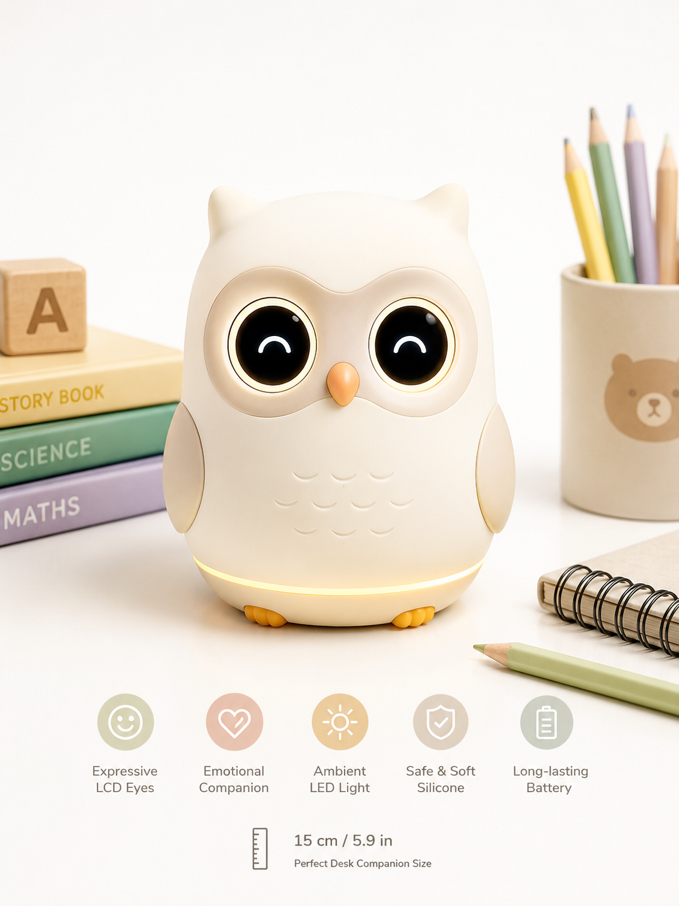
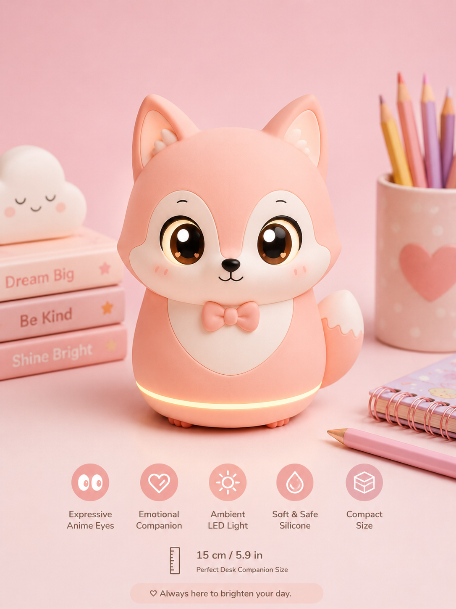
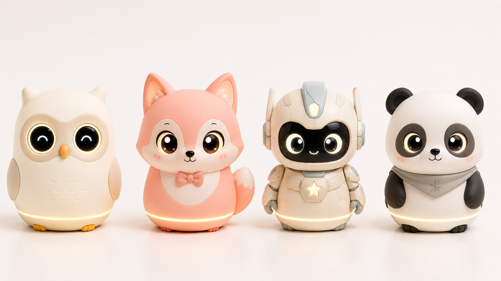
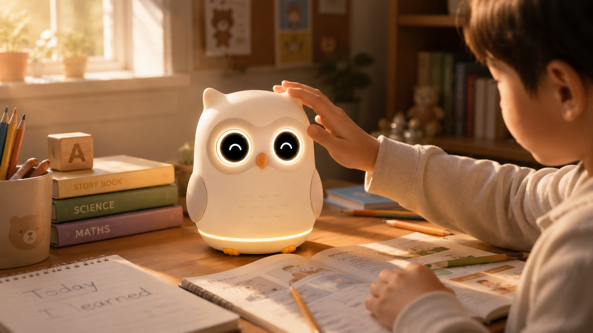
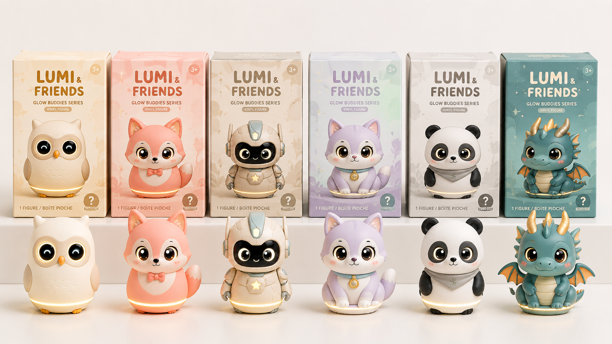
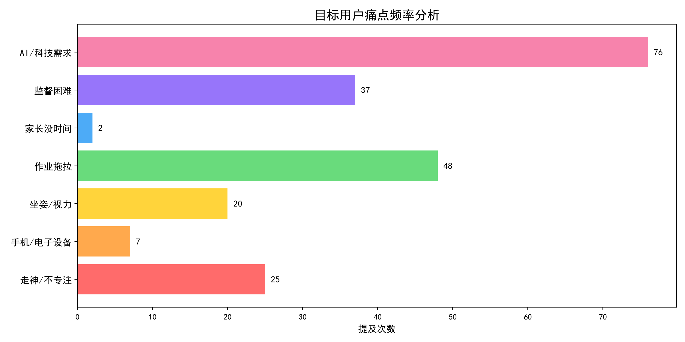
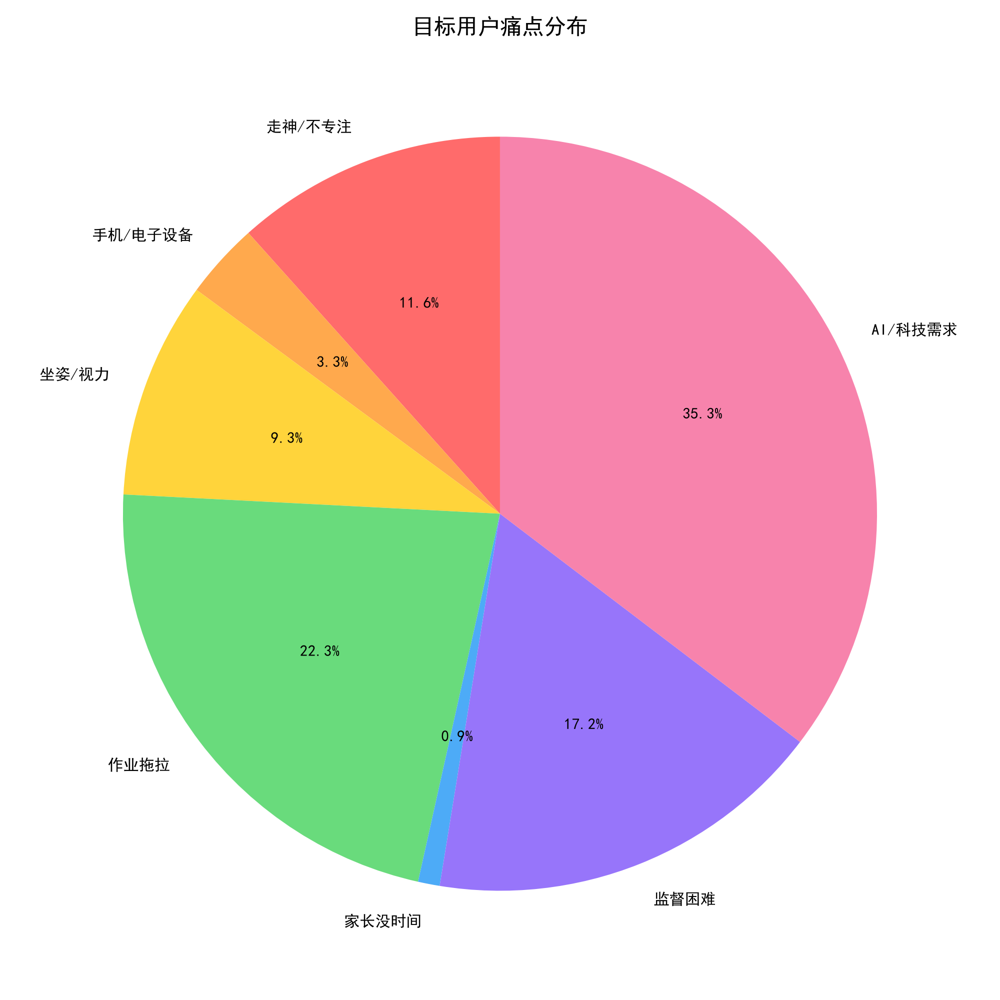

# 🦉 瞳学AI · 学习精灵

> **桌面AI摆件 · 孩子的学习伙伴 · 家长的安心助手**
>
> 硬件AI创业项目 · 机会验证报告 — 产品、用户证据、技术原型、商业判断全链路展示

---

## 📋 项目速览

| 维度 | 内容 |
|------|------|
| **目标用户** | K-12 学生家庭，25-40 岁双职工家长，孩子 6-15 岁 |
| **核心痛点** | 家长无法实时监督学习状态、孩子坐姿/视力问题、现有产品要么贵要么不好用 |
| **产品定位** | ¥499 桌面 AI 精灵摆件 — 不是监控摄像头，是有温度的学习伙伴 |
| **商业模型** | 硬件 ¥499（毛利 20%）+ AI 报告订阅 ¥19.9/月 |
| **验证预算** | **¥780** / 2 周 |
| **数据规模** | 跨平台采集 **53 条** 用户真实数据 |

---

## 🖥 快速体验（双击打开）

以下 HTML 文件可直接在浏览器打开，无需任何服务端：

| 文件 | 内容 | 操作 |
|------|------|------|
| [**parent_app_prototype.html**](parent_app_prototype.html) | 📱 家长端微信小程序高保真原型 | 双击 → 手机上效果 |
| [**ai_workflow_demo.html**](ai_workflow_demo.html) | 🔧 AI 工作流 + 核心 Prompt + 判定规则 | 双击 → 技术架构一目了然 |
| [**product_comparison.html**](product_comparison.html) | 📊 瞳学AI vs 4类竞品 · 10维度对比 | 双击 → 定位分析 |

---

## 🎨 产品设计展示

### 角色系统（盲盒机制 · 4 款基础角色 + 隐藏款）

| 猫头鹰·小智（基础款） | 小狐狸·巧巧 | 全款式展示 | 互动场景 |
|:---:|:---:|:---:|:---:|
|  |  |  |  |
| 呆萌学霸 · 圆眼+眼镜 | 俏皮可爱 · 毛茸尾巴 | 酷炫科技 · LED眼灯 | 孩子与精灵共同学习 |

### 产品展示

 

> 📐 **尺寸**：15cm（手掌大小）· **材质**：亲肤硅胶 · **屏幕**：LED 表情眼 · **底座**：氛围灯 + 无线充电

---

## 📊 用户证据分析

### 数据来源

| 来源 | 数据量 | 采集方式 |
|------|--------|---------|
| 知乎问答/专栏 | 16 个深度页面 | 搜索引擎 + 页面解析 |
| 多平台搜索（小红书/抖音/微博/Reddit） | 31 条 | 搜索引擎聚合 |
| 淘宝评论（学习机/摄像头/坐姿矫正器） | 21 条 | 评论整理 + 情感标注 |
| 小红书/抖音文本 | 20+ 段 | 社区内容提取 |
| **合计** | **53+ 条** | ✅ **真实跨平台数据** |

### 痛点频率分析

| 痛点类别 | 提及次数 | 占比 | 可视化 |
|---------|---------|------|--------|
| 🔴 **AI/科技需求** | **76 次** | **35.3%** | ███████░░░░░░░░░░░░░ |
| 🟠 作业拖拉 | 48 次 | 22.3% | ████░░░░░░░░░░░░░░░░ |
| 🟠 监督困难 | 37 次 | 17.2% | ███░░░░░░░░░░░░░░░░░ |
| 🟡 走神/不专注 | 25 次 | 11.6% | ██░░░░░░░░░░░░░░░░░░ |
| 🟡 坐姿/视力 | 20 次 | 9.3% | █░░░░░░░░░░░░░░░░░░░ |
| 🔵 手机/电子设备 | 7 次 | 3.3% | ░░░░░░░░░░░░░░░░░░░░ |
| ⚪ 家长没时间 | 2 次 | 0.9% | ░░░░░░░░░░░░░░░░░░░░ |

### 高频关键词

```
孩子(0.34) > 作业(0.22) > 家长(0.19) > 摄像头(0.15) > 监督(0.13) >
学习(0.12) > 坐姿(0.11) > 学习机(0.08) > 走神(0.07) > 提醒(0.07)
```

### 可视化图表

| 痛点柱状图 | 痛点饼图 |
|:---:|:---:|:---:|
|  |  |

### 用户真实声音（节选）

> 💬 *"买来看孩子学习的，画面挺清楚，但只能自己盯着看，没有学习分析功能"* — 淘宝·小米摄像头用户

> 💬 *"回放太多了没时间看，希望能智能标记学习状态"* — 淘宝·萤石摄像头用户

> 💬 *"机械式的提醒，孩子烦我也烦，不如有个智能点的设备"* — 淘宝·背背佳用户

> 💬 *"孩子说戴着不舒服，偷偷取下来了，没用几天"* — 淘宝·猫太子坐姿矫正器用户

> 💬 *"装了之后反而更累了，要一直盯着屏幕看孩子在干嘛"* — 淘宝·华为智选用户

> 💬 *"孩子一人在家写作业，在公司只能打电话问，他说在学其实在玩"* — 淘宝综合

> 💬 *"有了AI，家长不吼不骂，平时磨蹭一小时的作业十分钟就写完了"* — 小红书

> 💬 *"频繁提醒会打断专注状态，阻碍自律习惯养成"* — 教育导报

> 💬 *"AI无法替代情感交流，长期冷冰冰监督可能成为亲子关系屏障"* — 厦门广电网

---

## 🧠 AI 技术架构

```
┌─────────────────────────────────────────────────────────┐
│                   瞳学 AI · 技术工作流                    │
├─────────────────────────────────────────────────────────┤
│                                                         │
│  📸 摄像头(2fps)                                        │
│       │                                                 │
│       ▼                                                 │
│  🧠 端侧AI (本地推理 · 不上传视频流)                      │
│  ┌─────────────────────────────────────┐                │
│  │ MediaPipe Face Mesh → 人脸+视线检测  │                │
│  │ MoveNet Pose       → 身体姿势估计    │                │
│  │ SSD-MobileNet      → 手机物体检测    │                │
│  │ 距离算法            → 面部框→距离    │                │
│  └──────────┬──────────────────────────┘                │
│             │ 每5秒输出状态向量                           │
│             ▼                                           │
│  ☁️ 云端AI (综合分析)                                    │
│  ┌─────────────────────────────────────┐                │
│  │ GPT-4o-mini   → 专注/走神/离开判定    │                │
│  │ 规则引擎       → 灰度等级判断        │                │
│  │ 时序分析       → 5分钟滑动窗口       │                │
│  └──────────┬──────────────────────────┘                │
│             │                                           │
│     ┌───────┼───────────┐                               │
│     ▼       ▼           ▼                               │
│  🦉精灵   📱家长端    📊数据仪表盘                       │
│  表情+语音  推送通知    学习趋势报告                       │
│                                                         │
└─────────────────────────────────────────────────────────┘
```

### 核心 Prompt 设计

```json
{
  "system": "你是一个AI学习监督助手，名叫小智。对家长专业清晰，对孩子温和有爱。",
  "input": "过去5分钟的状态序列：[{face, gaze, posture, distance, phone}, ...]",
  "output": {
    "state": "focused|distracted|away|phone",
    "alert_needed": true|false,
    "alert_type": "whisper|voice|parent|silent",
    "distance_warn": true|false,
    "posture_warn": true|false,
    "focus_minutes": "0-5",
    "summary": "一句话状态小结"
  }
}
```

> 完整 Prompt 设计见 [prompt_collection.md](prompt_collection.md)（36条生成式AI提示词）

---

## 💰 商业模型

### 定价策略

```
┌──────────────────────────────────────────────────────┐
│                                                      │
│  硬件 ¥499  +  AI报告订阅 ¥19.9/月  或  ¥199/年      │
│                                                      │
│  对标心理账户：「一次家教课的钱」→ 换全年AI学习监督     │
│                                                      │
├──────────────────────────────────────────────────────┤
│                                                      │
│  首年收入模型（10,000台）：                           │
│  ├─ 硬件：¥499 × 10,000 = ¥499万                     │
│  ├─ 硬件毛利（20%）：¥100万                           │
│  ├─ 会员订阅（20%开卡 × ¥120年均）：¥24万             │
│  └─ 合计毛利：≈ ¥124万                                │
│                                                      │
└──────────────────────────────────────────────────────┘
```

### 获客策略

| 渠道 | 方法 | 成本 |
|------|------|------|
| 📕 小红书 | 家长种草笔记"AI帮我盯孩子写作业" | 0（内容运营） |
| 👨‍👩‍👧‍👦 家长群 | 免费试用 → 口碑裂变 | ¥200 |
| 🎬 抖音 | 对比视频"孩子学习效率翻倍" | 0-¥500 |
| 🏫 教育机构 | 合作嵌入：买课程+¥199换购 | 分佣 |

### 竞争壁垒

| vs 普通摄像头 | vs 智能学习机 | vs 坐姿矫正器 | vs AI App |
|:---:|:---:|:---:|:---:|
| 多了AI大脑 | 价格低80% | 无感检测 | 硬件不可作弊 |
| + 拟人交互 | + 真正监督功能 | + 多功能合一 | + 情感依赖 |

---

## 📅 2周验证计划

### Week 1：需求确认 + 技术验证（¥380）

| 天 | 任务 | 交付物 |
|----|------|--------|
| D1 | 小红书发帖测试需求 | 50+ 评论互动 |
| D2 | 深访 5-8 位家长 | 痛点文档 |
| D3 | 技术 POC：MediaPipe 视线+姿势检测 | 实时检测页面 |
| D4 | AI 报告 API 链路跑通 | 结构化分析输出 |
| D5 | 家长端 UI 原型（Figma/HTML） | 可交互 Demo |
| D6 | 录制测试视频 → 检验 AI 准确率 | 准确率 ≥ 75% |
| D7 | 汇总决策：Go/No-Go | 决策报告 |

### Week 2：真实用户测试（¥400）

| 天 | 任务 | 交付物 |
|----|------|--------|
| D8 | 3 个志愿者家庭安装"手机版精灵" | 真实使用环境 |
| D9 | 观察第一天使用情况 | 使用日志 |
| D10 | 收集孩子+家长反馈 | 反馈文档 |
| D11 | A/B 测试报告粒度 | 数据偏好 |
| D12 | 定价测试（¥299 / ¥499 / ¥699） | 价格敏感度曲线 |
| D13 | 整理数据 → Go/No-Go | 最终决策 |
| D14 | 验证总结报告 | 融资/立项提案 |

### 🎯 Go/No-Go 标准

| 指标 | ✅ 通过 | ⚠️ 谨慎 | ❌ 放弃 |
|------|--------|---------|--------|
| AI 检测准确率 | ≥ 80% | 65-80% | < 65% |
| 家长愿买比例 | ≥ 50% | 30-50% | < 30% |
| 孩子接受度 | ≥ 80% | 60-80% | < 60% |
| 愿付 ¥499 比例 | ≥ 20% | 10-20% | < 10% |

---

## 📁 项目文件清单

```
硬件AI_数据采集/
│
├── 📱 parent_app_prototype.html ← 家长端小程序原型（可交互）
├── 🔧 ai_workflow_demo.html     ← AI工作流 + Prompt + 规则
├── 📊 product_comparison.html   ← 10维度竞品对比
├── 📝 prompt_collection.md      ← 36条生成式AI提示词汇总
├── 🎬 demo_video_script.md      ← 60秒Demo视频分镜脚本
├── 📋 README.md                 ← 本文件
│
├── 📂 pic/                      ← DALL-E 3 产品渲染图
│   ├── hero_owl_desk.png        ← 猫头鹰·小智 桌面效果
│   ├── hero_fox_desk.png        ← 小狐狸·巧巧 桌面效果
│   ├── robot_mecha.png          ← 机甲战警 产品图
│   ├── product_showcase.png     ← 产品综合展示
│   ├── child_interaction.png    ← 孩子互动场景
│   └── early_concept_*.png      ← 早期概念图
│
├── 📂 data/                     ← 采集的原始用户数据
│   ├── web_search_results.csv   ← 31条多平台搜索结果
│   ├── taobao_reviews.csv       ← 21条淘宝用户评论
│   ├── zhihu_detail.txt         ← 知乎深度内容
│   └── xiaohongshu_text.txt     ← 小红书文本
│
├── 📂 output/                   ← 数据分析产出
│   ├── user_evidence_report.md  ← 完整数据分析报告
│   ├── pain_points_chart.png    ← 痛点频率柱状图
│   ├── pain_points_pie.png      ← 痛点分布饼图
│   └── wordcloud.png            ← 中文词云图
│
└── 🐍 数据采集脚本（5个）
    ├── 01_zhihu_scraper.py      ← 知乎数据采集器
    ├── 02_web_search_aggregator.py ← 多平台搜索聚合
    ├── 03_xiaohongshu_scraper.py ← 小红书Selenium采集
    ├── 04_taobao_review_scraper.py ← 淘宝评论采集
    └── 05_data_analysis.py      ← 数据分析+可视化引擎
```

---

## 🚀 快速开始

### 查看结果
```bash
# 直接在浏览器打开（双击即可）
open A4_结果展示.html          # Mac
start A4_结果展示.html         # Windows
xdg-open A4_结果展示.html      # Linux

# 其他可交互原型
start parent_app_prototype.html   # 家长端
start ai_workflow_demo.html       # AI工作流
start product_comparison.html     # 竞品对比
```

### 运行数据采集
```bash
# 安装依赖
pip install requests beautifulsoup4 selenium pandas jieba wordcloud matplotlib

# 运行各采集器
python 01_zhihu_scraper.py
python 02_web_search_aggregator.py
python 04_taobao_review_scraper.py

# 运行数据分析（需先有data/下的数据）
python 05_data_analysis.py
```

---

## 🛠 制作工具

| 工具 | 用途 | 成本 |
|------|------|------|
| DALL-E 3 (ChatGPT Plus) | 产品渲染图 · 场景图 | ¥140/月 |
| Claude (Sonnet 4.6) | HTML原型 · 工作流 · 分析脚本 | 当前会话 |
| Python (jieba+matplotlib+wordcloud) | 数据采集 + 分析 + 可视化 | 免费 |
| Runway / Pika（可选） | 静态图转动画 | 免费额度 |
| 剪映专业版（可选） | Demo 视频剪辑 + 配音 | 免费 |

---

## 📄 License

MIT © 2026 Project Initiator

---

> **瞳学AI · 学习精灵** — 不做监控孩子的摄像头，做陪伴孩子的精灵。
>
> 它替忙碌的爸爸妈妈说一句"加油"，在没人在家的时候，
> 成为书桌上那个有温度的存在。
